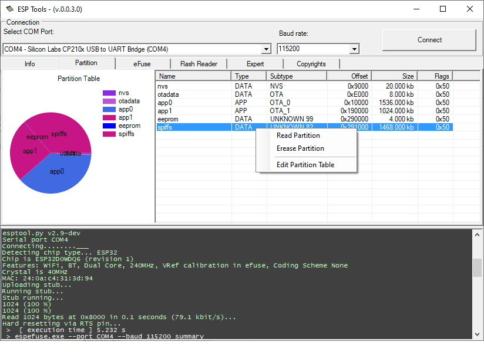

# ESPToolsGUI (beta)
 ESP Tools GUI for Windows
 This is just a GUI interface for the espressif python scripts.
 
 The scripts are converted to exe and the GUI just calls them over the console.
 
 
 
This is the first version, just to test and get some data... So the todo list is really big!

In future, it should be possible to write efuses and change partition size.

You can compile it by yourself (as it is not signed) or download it from the releases.

|   |   |
|--------|--------|
|  |   |

## Links
ESP Tools - all Python scripts:  
https://github.com/espressif/esptool/wiki

PY 2 EXE - converter to catch console output to GUI:  
https://github.com/brentvollebregt/auto-py-to-exe

